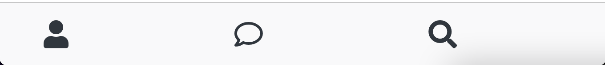

# KAKAO-CLONE

## 1) 단축키

- vscode에서 html 파일에 !를 치면 자동으로 html document를 생성할 수 있음

<br><br>

## 2) BEM (Block Element Modifier)

좀 더 쉽게 읽히는 CSS 네이밍 방법(권장)

- **block**: 구성 요소의 가장 바깥쪽 상위 요소
- **element**: 구성 요소 안쪽에는 하나 또는 그 이상의 요소가 있을 수 있다
- **Modifier**: 블록 또는 요소는 변경자를 이용하여 변경을 표시할 수 있다.

```CSS
.block_element--modifier
```

<br>

```CSS
/* Block Component */
.btn {}

/* Element that depends upon the block */
.btn__price {}

/* Modifier that changes the style of the block */
.btn--orange {}
.btn--big {}
```

<br>

예제는 아래 코드를 참고한다.

```HTML
<a class="btn btn--big btn--orange" href="https://css-tricks.com">
    <span class="btn__price">$9.99</span>
    <span class="btn__text">Subscribe</span>
</a>
```

<br><br>

## 3) icon

- [Heroicons](https://heroicons.com/)
- [FontAwesome](https://fontawesome.com/)

FontAwesome에서 icon을 더 큰 사이즈로 사용하고 싶다면, 먼저 큰 아이콘이 지원되는지 확인해보고 아래와 같이 fa-2x처럼 작성한다.

```HTML
<i class="fas fa-battery-full fa-2x"></i>
```

<br><br>

## 4) Font

- vscode에서 font-family를 쓰면 자동으로 추천해줌
- 만약 다른 폰트를 찾고 싶다면 [google Fonts](https://fonts.google.com/)를 이용한다.
- font는 head에 link를 사용해서 추가할 수도 있지만 CSS를 사용해서 추가하는 것을 권장함
- google Fonts에서 @import 방식으로 복사해온 뒤 css 파일 상단에 붙여 넣는다.

<br><br>

## 5) css hack

- 현재 status bar에 설정한 justify-content: space-between이 element 별로 서로 다른 width로 인해 시계가 중앙으로 오지 않음
- justify-content: space-between에서 justify-content: center로 변경한 후, div.status-bar\_\_column의 width를 33%로 준 뒤, 두번째 column의 자식 요소를 중앙에 둔다.

```CSS
.status-bar {
  display: flex;
  justify-content: center;
}
.status-bar__column {
  width: 33%;
}
.status-bar__column:first-child span {
  margin-right: 5px;
}
.status-bar__column:nth-child(2) {
  display: flex;
  justify-content: center;
}
.status-bar__column:last-child {
  display: flex;
  justify-content: flex-end;
  align-items: center;
}

```

<br><br>

## 6) Reset CSS

- 대부분의 태그에 margin:0, padding:0, border:0 등을 가진 css 파일을 말함
- https://meyerweb.com/eric/tools/css/reset/
- reset.css파일을 만들고 styles.css파일 상단에서 import 시킨다

```CSS
@import "reset.css";
```

<br><br>

## 7) variables.css

- variables.css를 만들고 styles.css에서 import 한다.

<br><Br>

## 8) :not()

- 스타일을 적용시키고 싶지 않을 경우 사용

```CSS
body :not(p){

}
```

<br><br>

## 9) navigation

아래와 같은 형식으로 navigation을 만드는 것이 좋다.
검색엔진 구글도 navigation을 찾아서 ul의 li 태그 안에 있는 link를 가져오게끔 설정되어 있다.

```HTML
<nav>
  <ul>
    <li>
      <a href="#">
    </li>
  </ul>
</nav>
```

<br>

vscode 단축키로 아래와 같이 작성하면 nav 태그 내 ul 태그 아래에 a 태그를 가지고 있는 li 태그 4개를 생성해준다.

```
nav>ul>li*4>a
```

<br><br>

## 10) css 순서

css import 하는 순서가 중요하다.
styles.css에서 첫줄에는 폰트를 import 했고, 그 다음 모든 style을 reset 한 후, variables.css파일을 import 했다.

```CSS
/* styles.css */

@import url("https://fonts.googleapis.com/css2?family=Open+Sans:wght@400;600&display=swap");
@import "reset.css";
@import "variables.css";
/* Components */
@import "components/status-bar.css";
@import "components/nav-bar.css";
/* Screens */
@import "screens/login.css";

body {
  font-family: "Open Sans", sans-serif;
}
```

<br><br>

## 11) Border Box

CSS 박스 모델의 기본값은 요소에 테두리나 안쪽 여백이 있으면 너비와 높이에 더해서 화면에 그린다. 따라서 크기를 설정할 때 원하는 크기를 얻으려면 테두리나 안쪽 여백을 고려해야 한다.

<br>

**box-sizing** 속성을 사용해 이 방식을 바꿀 수 있다.

- **content-box**는 box-sizing의 기본값으로 요소의 너비를 100픽셀로 설정하면 콘텐츠 영역이 100픽셀의 너비를 가지고, 테두리와 안쪽 여백은 이 값에 추가된다
- **border-box**는 테두리와 안쪽 여백의 크기도 요소의 크기로 고려한다. 너비를 100픽셀로 설정하고 테두리와 안쪽 여백을 추가하면, 콘텐츠 영역이 줄어들어 총 너비 100픽셀을 유지한다.

<br>



현재 우리가 만든 navigation도 내부에 지정된 padding 값으로 인해 ellipsis 아이콘이 보이지 않는다.

이때 box-sizing 값으로 border-box를 주게 되면 보이지 않던 ellipsis 아이콘이 보여지게 된다.

<br><br>

## 12) span

- span은 inline이므로 margin이 적용되지 않는다. margin을 적용시키기 위해서는 display: block으로 변경한다.

```CSS
.recommended-friends span {
  display: block;
  margin: 110px 0;
  text-align: center;
}
```

<br><br>

## 13) z-index

- div가 있는 위치가 맨 앞에서부터 몇 번째인지를 나타냄
- 즉 layer의 순서가 몇 번째인지 나타냄
- layer는 포토샵이나 스케치의 레이어를 생각하면 됨
- display 작업을 하거나 position 작업을 하면 layer를 갖게 된다.
- z-index는 absolute position이나 fixed position에 대해 설정할 수 있다.
