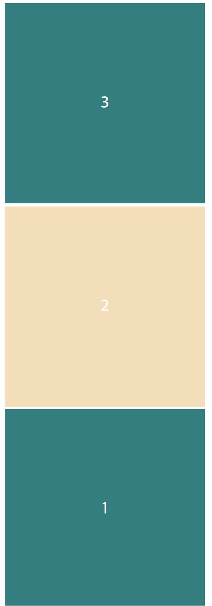
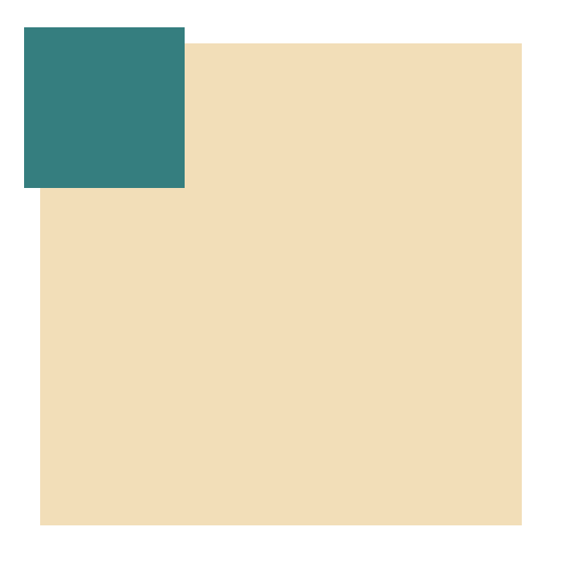

# CSS

## 1) HTML에 CSS를 추가하는 방법

### (1) css 파일 분리

- css 파일을 별도로 만들고, html의 head 부분에 link 태그를 이용하여 불러온다.

```HTML
 <link href="styles.css" rel="stylesheet"/>
```

### (2) 인라인 css

- \<style\> 태그 안에 css를 직접 작성한다.

<br><br>

## 2) Cascading

CSS는 cascading 즉, 위에서부터 아래로 차례로 적용된다. 결국 맨 마지막에 있는 코드가 가장 마지막에 적용된다.

<br><br>

## 3) Blocks & Inline

- div와 같은 Box 속성들은 옆에 아무것도 오지 않는다. (div, header, main, section, footer, article)
- span 태그는 바로 옆에 다른 요소가 올 수 있다.
- 옆에 다른 요소가 못 오는 걸 **block**이라고 부르고, 다른 요소가 올 수 있는 것을 **inline**이라고 부른다.
- block이 아닌 요소는 span, a, img 등이 있다.
- 코드: [02.blacks_and_inline.html](02.blocks_and_inlines.html)

<br>

### (1) inline -> block

display 속성에 block으로 설정한다

```CSS
span {
    display: block;
}
```

<br>

### (2) block -> inline

div의 display 속성을 inline으로 변경하면 더이상 div 영역은 보이지 않게 되는데, inline은 width와 height을 가질 수 없기 때문이다

```CSS
div {
    height: 150px;
    width: 150px;
    background-color: tomato;
    display: inline;
}
```

<br><br>

## 4) block

block은 box로 margin, padding, border를 설정할 수 있다.

- 브라우저는 기본적으로 margin과 같은 user agent stylesheet를 제공한다.
- 아래처럼 따로 margin을 설정하지 않았는데도 브라우저에서 기본적으로 marin: 8px;를 주고 있다.

```CSS
body {
    display: block;
    margin: 8px;
}
```

<br>

### (1) margin

- box의 border(경계)의 바깥에 있는 공간
- 별개로 CSS에서 아래와 같이 margin 값을 주면 CSS는 Cascading이므로 결국 margin:0 이 적용되어, 위에서 적용한 margin 값은 적용되지 않는다.

```CSS
body {
    background-color: thistle;
    margin-top: 20px;
    margin-left: 10px;
    margin-right: 5px;
    margin-bottom: 10px;
    margin: 0;
}
```

- margin 값이 1개이면 사방으로 적용이 되고, marin 값이 2개이면 (상,하), (좌,우)로 적용이 되며, margin 값이 4개이면 시계 방향과 같이 위쪽, 오른쪽, 아래쪽, 왼쪽 순으로 적용된다.

<br>

### (2) collapsing margins


  
- 위 그림에서 CSS는 아래와 같다. 이때 사진처럼 div 태그에 상하로 적용된 margin이 20px이 있음에도 분홍색 body 태그와 div 태그는 상하 영역이 서로 붙어있다.
- 이 현상이 **collapsing margins** 현상이며 위, 아래쪽에서만 일어난다.
- collapsing margins 현상은 각 영역의 경계가 서로 같을 때 일어나고, 이 때 두 영역의 margin은 하나가 되며, 위 아래에서만 일어난다.
- 경계가 닿아서 margin이 같아졌나보구나 생각

```CSS
html {
    background-color: tomato;
}
body {
    background-color: thistle;
    margin: 20px 15px 40px 60px;
}

div {
    margin: 20px 15px;
    height: 150px;
    width: 150px;
    background-color: white;
}
```

<br>

### (3) padding

- margin과 반대되는 개념으로 box의 border(경계)의 안쪽에 있는 공간이다

<br>

### (4) border

- border는 말 그대로 box의 경계이다.
- border는 inline과 black 모두에 적용된다.
- CSS는 cascading이므로 아래와 같이 코드를 작성하면, span 태그는 점선 border가 적용된다.

```CSS
<html lang="kr" >
    <head>
        <meta charset="utf-8" />
        <title>CSS</title>
        <style>
            * {
                border: 2px solid black;
            }
            span {
                border-style: dotted;
            }
        </style>

    </head>
    <body>
        <div id="first">
            <div id="second">
                <div id="third">
                    <span>Hello</span>
                </div>
            </div>
        </div>
    </body>
</html>

```

<br><br>

## 5) Inline

- Inline에서도 border 속성이 적용된다.
- margin과 padding도 inline에서 적용될까? 아래와 같은 코드가 있다

```HTML
<!DOCTYPE html>
<html lang="kr" >
    <head>
        <meta charset="utf-8" />
        <title>Inline</title>
        <style>
            body {
                margin: 20px;
            }
            span {
                background-color: yellowgreen;
                padding: 20px;
                margin: 30px;
            }
        </style>

    </head>
    <body>
       <span>Hello</span>
       <span>Hello</span>
    </body>
</html>
```

<br>

- 위 코드는 아래 스크린샷 화면과 같다.


<br>

- ❗️ inline에서 padding은 4방향 모두 적용되지만 inline은 height와 width가 없으므로 margin은 좌우로만 가질 수 있다.
- 그러므로 위 아래 margin을 적용하고 싶다면 inline 요소들을 block으로 바꿔야 한다.

<br><br>

## 6) Classes

- class명은 유일할 필요가 없다. 여러 요소들이 같이 쓸 수 있다
- 한번에 여러 class를 쓸 수도 있다. 어떤 요소는 class가 하나일 수 있지만 다른 요소는 세 개를 가질 수도 있다.

<br><br>

## 7) display: inline-block

- 아래 코드와 같이 div box 속성에 display: inline을 주면 inline은 너비와 높이를 가질 수 없으므로 화면에 보이지 않는다.
- 이럴 때는 **inline-block**을 이용한다.

```HTML
<!DOCTYPE html>
<html lang="kr" >
    <head>
        <meta charset="utf-8" />
        <title>Inline</title>
        <style>
            body {
                margin: 20px;
            }
            div {
                display: inline;
                width: 50px;
                height: 50px;
                background-color: teal;
            }
        </style>

    </head>
    <body>
       <div></div>
       <div></div>
       <div></div>
       <div></div>
    </body>
</html>
```

<br>

- inline-block은 block으로 인식하게 하고, height도 가질 수 있고 사방에 margin도 가질 수 있다. 또한 block과는 달리 바로 옆에 다른 요소가 올 수도 있다.

<br>


<br>

- 하지만 inline-block은 사용하기에 별로고 많은 문제가 있다.
- 위 스크린샷처럼 뭔지는 몰라도 사이에 빈 공간이 있고, 예상치 못한 이 점이 제어하기 어렵다
- inline-block은 Resposive Design(반응형 디자인)을 지원하지 않는다.

<br><br>

## 8) FlexBox

- 위의 inline-block의 문제를 고치기 위해 나온 방법
- 자식 엘리먼트에는 어떤 것도 적지 말아야 한다. 부모 엘리먼트에만 명시해야 한다.
- 부모 엘리먼트를 flex container로 만들어야 함
- 아래 예제에서는 div의 부모인 body를 display:flex로 만든다.

```HTML
<!DOCTYPE html>
<html lang="kr" >
    <head>
        <meta charset="utf-8" />
        <title>Inline</title>
        <style>
            body {
                margin: 20px;
                display: flex;
            }
            div {
                width: 300px;
                height: 300px;
                background-color: teal;
            }
        </style>

    </head>
    <body>
       <div></div>
       <div></div>
       <div></div>
       <div></div>
    </body>
</html>
```

- 위 div 엘리먼트들은 여전히 block이고, margin과 padding을 가질 수 있다.

<br><br>


- 위 그림과 같이 flexbox에는 main-axis(주축)이 있고 cross-axis(교차축)이 있다.
- main-axis는 수평으로 default가 설정되어 있고, cross-axis는 수직으로 default가 설정되어 있다.
- **justify-content**는 main-axis에 적용된다.
- **align-items**는 cross-axis에 적용된다.

<br><br>

### (1) justify-content

- **flex-start**: 요소들을 main-axis 축의 시작 위치에 정렬 (왼쪽)
- **flex-end**: 요소들을 main-axis 상의 끝 위치로 정렬 (오른쪽)
- **center**: 요소들을 컨테이너 가운데로 정렬
- **space-between**: 요소들 사이에 동일한 간격을 둠
- **space-around**: 요소들 주위에 동일한 간격을 둠

<br>

### (2) align-items

- **flex-start**: 요소들을 컨테이너의 cross-axis 상의 시작 위치에 정렬 (보통 꼭대기)
- **flex-end**: 요소들을 컨테이너의 바닥cross-axis 상의 끝으로 정렬 (보통 바닥)
- **center**: 요소들을 컨테이너의 cross-axis 상의 가운데로 정렬
- **baseline**: 요소들을 컨테이너의 시작 위치에 정렬
- **stretch**: 요소들을 컨테이너에 맞도록 늘림

<br>

### (3) flex-direction

- **row**: 요소들을 텍스트 방향과 동일하게 정렬
- **row-reverse**: 요소들을 텍스트의 반대 방향으로 정렬
- **column**: 요소들을 위에서 아래로 정렬
- **column-reverse**: 요소들을 아래에서 위로 정렬

<br>

- main-axis와 cross-axis의 방향을 바꿀 수 있다.
- display:flex 일 때 default는 row이다
- **flex-direction:column**이면 main-axis는 수직이 되고, cross-axis가 수평이 된다.


<br>

- **flex-direction: column-reverse**



<br>

- **flex-direction: row-reverse**


<br><br>

### (4) flex-wrap

- **nowarp**: 모든 요소들을 한 줄에 정렬한다
- **wrap**: 요소들을 여러 줄에 걸쳐 정렬한다
- **wrap-reverse**: 요소들을 여러 줄에 걸쳐 반대로 정렬한다.

<br>

- **flex-wrap:nowrap** 일 때 발생한다. (default)
- flexbox는 기본적으로 width를 초기 사이즈로만 여기고, 모든 엘리먼트들을 같은 줄에 있게 하기 위해 width를 바꿀 수도 있다.


<br>

- **flex-wrap: wrap;** 으로 설정하면 명시된 사이즈인 300px를 반영한다
- wrap으로 설정하면 한 줄에 들어가는 만큼 최대한 집어넣고 그게 되지 않으면 다음 줄로 옮긴다.


<br>

- **flex-wrap: wrap-reverse**를 설정하면 위 사진과는 정반대의 현상이 발생한다


<br><br>

### (5) flex-flow

- flex-direction과 flex-wrap은 자주 같이 사용되기 때문에 flex-flow가 이를 대신할 수 있다. 이 속성은 공백 문자를 이용하여 두 속성의 값들을 인자로 받는다
- **flex-flow: row wrap** 요소들을 가로선 상의 여러줄에 걸쳐 정렬할 수 있다.

<br>

### (6) align-content

- 여러 줄 사이의 간격을 지정할 수 있다.
- align-items는 컨테이너 안에서 어떻게 모든 요소들이 정렬되는지를 지정하고, align-content는 여러 줄들 사이의 간격을 지정한다.
- 한 줄만 있을 경우, align-content는 효과를 보이지 않는다.

- **flex-start**: 여러 줄들을 컨테이너의 꼭대기에 정렬한다
- **flex-end**: 여러 줄들을 컨테이너의 바닥에 정렬한다
- **center**: 여러 줄들을 컨테이너의 세로선 상의 가운데에 정렬한다
- **space-between**: 여러 줄들 사이에 동일한 간격을 둔다
- **space-around**: 여러 줄들 주위에 동일한 간격을 둔다
- **strecth**: 여러 줄들을 컨테이너에 맞도록 늘린다.

<br>

FlexBox 유용한 사이트: https://flexboxfroggy.com/#ko

<br><br><br>

## 9) Position

- position은 레이아웃보다는 위치를 아주 조금 위로, 아주 조금 오른쪽으로 옮기고 싶을 떄 사용한다.

<br>

### (1) Static

- default로 적용 됨
- 레이아웃이 박스를 처음 위치하는 곳에 두는 것을 말함

<br><br>

### (2) Fixed

- 위치를 고정시켜 줌
- 스크롤을 해도 그 위치에 있음
- fixed를 사용하면 레이어를 부수고 다른 레이어에 위치하게 된다. 모든 것의 위에 있게 된다.

```HTML
<!DOCTYPE html>
<html lang="kr" >
    <head>
        <meta charset="utf-8" />
        <title>Position</title>
        <style>
            body {
                height: 1000vh;
                margin: 10px
            }
            div {
                width: 300px;
                height: 300px;
                color: white;
                background-color: teal;
            }

            #different {
                position: fixed;
                background-color: wheat;
                width: 350px;
            }
        </style>

    </head>
    <body>
       <div></div>
       <div id="different"></div>
    </body>
</html>
```

<br>

- 위 코드는 wheat 컬러 div 위에 teal 컬러 div가 있고, wheat 컬러 div는 스크롤을 해도 위치가 고정됨.


<br>

- top, left, right, bottom 프로퍼티 중에 하나만 수정해도 wheat 컬러 div의 위치는 변경되고, div 끼리 서로 겹쳐질 수도 있음.
- 아래 사진은 #different div에 top:5px 값을 준 것이다.


<br>

- 반대로 위의 div 속성에 postion:fixed를 주게 되면 아래 div와 함께 겹쳐지게 된다.

```HTML
<!DOCTYPE html>
<html lang="kr" >
    <head>
        <meta charset="utf-8" />
        <title>Position</title>
        <style>
            body {
                height: 1000vh;
                margin: 10px
            }
            div {
                width: 300px;
                height: 300px;
                color: white;
            }
            #green {
               background-color: teal;
               position: fixed;
               opacity: 0.2;
            }
            #different {
                background-color: wheat;
            }
        </style>

    </head>
    <body>
       <div id="green"></div>
       <div id="different"></div>
    </body>
</html>
```

<br>


<br><br>

### (3) Relative

- 가끔 유용할 때가 있는데, 조금씩만 오른쪽 또는 왼쪽으로 옮기고 싶을 때 사용
- position을 relative로 하면 top, bottom, left, right 속성을 사용할 수 있다.
- element가 처음 위치한 곳을 기준으로 위치를 변경함

```HTML
<!DOCTYPE html>
<html lang="kr" >
    <head>
        <meta charset="utf-8" />
        <title>Position</title>
        <style>
            body {
                height: 1000vh;
                margin: 50px
            }
            div {
                width: 300px;
                height: 300px;
                background-color: wheat;
            }
            .green {
                position: relative;
                background-color: teal;
                height: 100px;
                width: 100px;
                top: -10px;
                left: -10px;
            }
        </style>

    </head>
    <body>
       <div>
           <div class="green"></div>
       </div>
    </body>
</html>
```

<br>

- 위 코드는 아래 캡처와 같다.



<br><br>

### (4) Absolute

- position: absolute도 top, left, bottom, right을 쓰고 싶을 때 사용할 수 있는데 좀 특이한 점이 있다.
- position: absolute는 가장 가까운 relative 부모를 기준으로 이동시켜준다.

<br>

```HTML
<!DOCTYPE html>
<html lang="kr" >
    <head>
        <meta charset="utf-8" />
        <title>Position</title>
        <style>
            body {
                height: 1000vh;
                margin: 50px
            }
            div {
                width: 300px;
                height: 300px;
                background-color: wheat;
            }
            .green {
                position: absolute;
                background-color: teal;
                height: 100px;
                width: 100px;
                top: 10px;
                left: 10px;
            }
        </style>

    </head>
    <body>
       <div>
           <div class="green"></div>
       </div>
    </body>
</html>
```

<br>

- 위 코드의 캡처 화면은 아래와 같다.


- green div의 부모 div는 relative가 아니라 static이다.
- body는 바깥 쪽에 있는 가장 relative한 부모가 될 수 있다.
- absolute는 부모 박스 기준이 아니라 body를 기준으로 위치가 변경된다
- 때문에 right: 0px을 주면 body의 맨 오른쪽으로 이동하게 된다.

<br><br>

- body를 기준으로 움직이고 싶지 않다면 부모 div에 position: relative를 준다.
- absolute는 가장 가까운 relative 부모 기준으로 위치를 변경한다.

```HTML
<!DOCTYPE html>
<html lang="kr" >
    <head>
        <meta charset="utf-8" />
        <title>Position</title>
        <style>
            body {
                height: 1000vh;
                margin: 50px
            }
            div {
                width: 300px;
                height: 300px;
                background-color: wheat;
                position: relative;
            }
            .green {
                position: absolute;
                background-color: teal;
                height: 100px;
                width: 100px;
                bottom: 0;
                right: 0;
            }
        </style>

    </head>
    <body>
       <div>
           <div class="green"></div>
       </div>
    </body>
</html>
```

<br>

- 위 코드는 아래 캡처와 같다.


<br><br><br>

## 10) Pseudo Selectors

- 더 세부적으로 엘리먼트를 선택해주는 것

```CSS
div:first-child {
    background-color: tomato;
}
div:last-child {
    background-color: teal;
}
```

- 이렇게 하는게 클래스나 아이디로 지정하는 것보다 더 좋은 방법

<br>

```CSS
span {
    background-color: tomato;
}
span:nth-child(even){
    background-color: teal;
}
span:nth-child(3n){
    background-color: moccasin;
}
```
